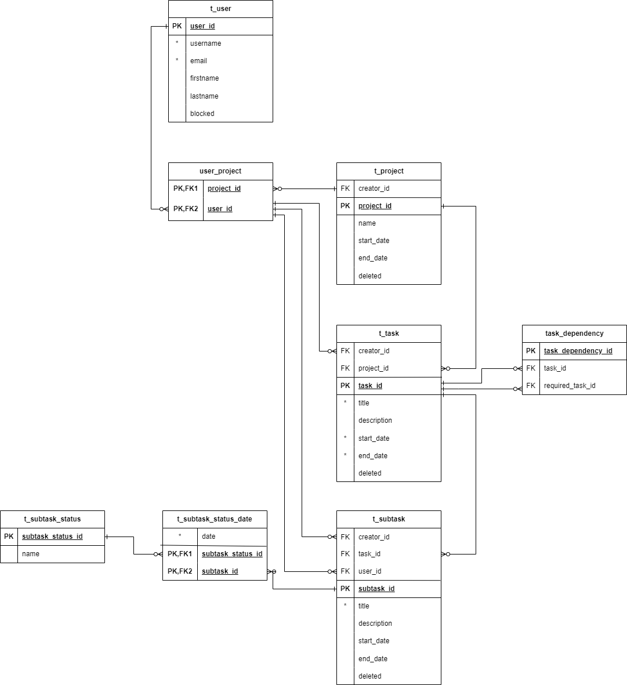

<h1 align = "center">Итоговый проект по дисциполине СИТ</h1>

Итоговая работа, направленная на создание простого Rest CRUD сервиса по выбранно описанной предметной области.

<h2>Что было задействовано:</h2>

За основы выполнения проекта была взята 4-ая лабораторная работа (предметная область), 2-я лабораторная работа (описание предметной области) и 5-я лабораторная работа (создание JWT аутентификации в проекте)

<h2>Структура СУБД</h2>

<h2>Выделение пользователи:<h2>

    <ol>
        <li>Обычный пользователь</li>
        <li>Администраторы системы</li>
    </ol>

<h2>Основные endpoints</h2>

/api/v1/users

<ol>
    <li>/{id} DELETE - Удаление пользователя (Только админ)</li>
    <li>/ GET - Просмотр пользователя по id</li>
    <li>/all GET - просмотр списка всех пользователей (Только админ)</li>
    <li>/ POST - Добавление пользователя (Только админ)</li>
    <li>/ PUT - Полная замена пользователя на нового (Только админ)</li>
    <li>/ PATCH - частичное изменение пользователя (Только админ)</li>
</ol>

/api/v1/project

<ol>
    <li>/{id} DELETE - Удаление проекта (Только создатель)</li>
    <li>/{id} GET - Просмотр проекта по id</li>
    <li>/ GET - просмотр списка всех проектов из бд (только админ)</li>
    <li>/ POST - создание проекта</li>
    <li>/ PUT - Полная замена информации о проекте на новую (Только создатель)</li>
    <li>/ PATCH - частичное изменение проекта (Только создатель)</li>
    <li>/invite - пригласть пользователя в проект (Только создатель)</li>
    <li>/kick - исключить пользователя из проекта (Только создатель)</li>
</ol>

/api/v1/task

<ol>
    <li>/{id} DELETE - Удаление задачи (Только создатель)</li>
    <li>/{id} GET - Просмотр задачи по id (Только создатель и участники проекта)</li>
    <li>/ GET - просмотр списка всех задач из бд (только админ)</li>
    <li>/ POST - создание задачи (Только создатель)</li>
    <li>/ PUT - Полная замена информации о задаче на новую (Только создатель)</li>
    <li>/ PATCH - частичное изменение задачи (Только создатель)</li>
</ol>

/api/v1/subtask

<ol>
    <li>/{id} DELETE - Удаление подзадачи (Только создатель)</li>
    <li>/ GET - Просмотр своих подзадач по определённым критериям (ProjectId or StatusName)</li>
    <li>/all GET - просмотр списка всех подзадач из бд (Только админ)</li>
    <li>/ POST - создание подзадачи (Только создатель)</li>
    <li>/ PUT - Полная замена информации о подзадаче на новую (Только создатель)</li>
    <li>/ PATCH - частичное изменение подзадачи (Только создатель)</li>
</ol>

/api/v1/subtask-statuses (Все действия, кроме GET запросов, может выполнять только администратор)

<ol>
    <li>/{id} DELETE - Удаление статуса (Только админ)</li>
    <li>/{id} GET - Просмотр статуса по id</li>
    <li>/ GET - просмотр списка всех статусов из бд</li>
    <li>/ POST - создание статуса (Только админ)</li>
    <li>/ PUT - Полная замена информации о статусе на новую (Только админ)</li>
    <li>/ PATCH - частичное изменение статуса (Только админ)</li>
</ol>

/swagger-ui/index.html - доступна всем в не зависимоти от аутентификации

<h2>Работа ещё в доработке, пойду немного посплю</h2>