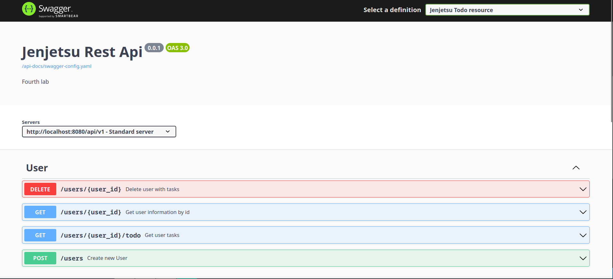

<h1 align="center">Task 4 + 5 - simple REST API (TODO project) With Security</h1>

Лабораторная работа №4 + 5 по предмету "Сетевые и интернет технологии"

<h2>Основная задача 4 лабы</h2>

Разработать простой REST сервис, который сможет:

<ol>
    <li>Добавлять пользователей</li>
    <li>Добавлять задачи пользователям</li>
    <li>Просматривать задачи пользователей</li>
    <li>Модифицировать задачи пользователя</li>
    <li>Удалять задачи пользователя и самого пользователя</li>
</ol>
<h2>Основная задача 5 лабы</h2>
<ol>
    <li>Проверять наличие bearer токена в заголовке</li>
    <li>Кэшировать токены на основе payoad</li>
    <li>Парсить права доступа из токена</li>
</ol>

Endpoints:

<ul>
    <li>POST /api/v1/user - создание пользователя</li>
    <li>GET /api/v1/user/{userId} - информация о пользователе</li>
    <li>GET /api/v1/user/{userId}/todo - список задач пользователя</li>
    <li>DELETE /api/v1/user/{userId} - удаление пользователя</li>
    <li>POST /api/v1/todo - создание задачи</li>
    <li>GET /api/v1/todo/{taskId} - информация о задаче</li>
    <li>PUT /api/v1/todo - изменение информации о задаче</li>
    <li>DELETE /api/v1/todo/{taskId} - удаление задачи</li>
</ul>

При этом:

<ol>
    <li>Если пользователя нет - то выкидывать 404</li>
    <li>Если задачи нет - то выкидывать 404</li>
    <li>Добавление существующего пользователя - выкидывать ошибку (выкидываю 400)</li>
</ol>
<h2>Необходимо для запуска</h2>
<ul>
    <li>Java версии 17+</li>
</ul>
<h2>Запуск проекта</h2>
<ol>
    <li>Скачать проект и открыть в удобной IDE</li>
    <li>Запустить проект</li>
</ol>

Или

<ol>
    <li>Скачать проект и перейти в папку с проектом</li>
    <li>В консоли прописать gradlew build</li>
    <li>Затем перейти по пути rest-api/build/libs и в консоли прописать java -jar rest-api-"project version"-SNAPSHOT.jar</li>
</ol>

Dockerfile писать в новый год лень

<h2>Swagger file</h2>

Вся API описана в swagger file и доступна при запуске проекта по ссылке http://localhost:8080/swagger-ui.html

<h2>Запросы</h2>

С установленным плагином REST Client на VS code можно поиграться с запросами.

Результаты запросов описаны в документе lab_4.docx

Результаты защиты приложения описан в документе lab_5.docx
