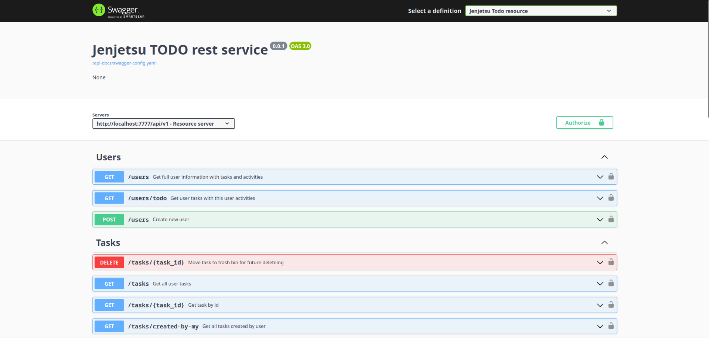

<h1>Jenjetsu TODO service</h1>

Учебный проект по web технологиям

<h2>Использрванный стек технологий:</h2>
<ol>
    <li>Java v.17.0</li>
    <li>Spring Boot v. 3.0.12</li>
    <li>Spring Security + Spring oauth2 resource server</li>
    <li>Docker</li>
</ol>
<h2>Необходимые требования для запуска</h2>
<ol>
    <li>Java v.17.0+</li>
    <li>Docker Engine release v.19.03.0+</li>
</ol>
<h2>Как запустить</h2>
<ol>
    <li>Клонировать и распаковать проект</li>
    <li>Выполнить команду <code>./gradlew build -x test</code></li>
    <li>Перейти в директорию keycloak</li>
    <li>Выполнить команду <code>docker compose build web-database keycloak web-application</code></li>
    <li>Запустить PostgresSql командой <code>docker compose up -d web-database</code></li>
    <li>Загрузить дамп БД командой <code>docker container exec -it web-database pg_restore -d jenjetsu_database postgres.dump</code></li>
    <li>Запустить остальные сервисы командой <code>docker compose up -d</code></li>
</ol>
<h2>Как пользоваться</h2>

Все эндпоинты сервиса описаны при помощи swagger конфигурации по ссылке http://localhost:7777/swagger-ui/index.html

Как выгладит конфигурация:

